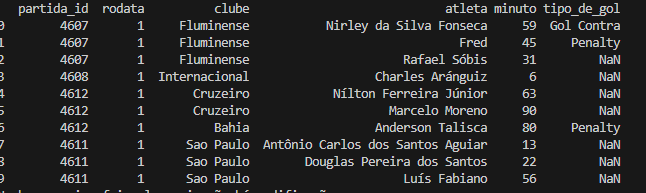
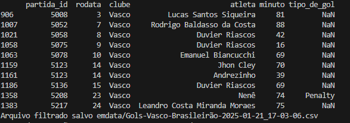
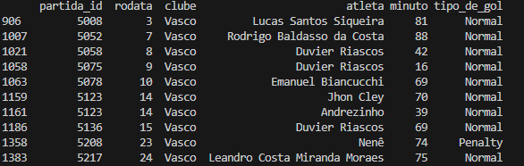

# Gols Brasileirão

# Manipulação de Dados de Gols do Brasileirão

## Ricardo Marques

Este projeto tem como objetivo processar e filtrar dados de um arquivo CSV contendo informações detalhadas sobre os gols marcados no Brasileirão. O processo foi organizado em etapas usando uma classe Python personalizada, garantindo uma estrutura modular e reutilizável para manipulação dos dados.

Neste exemplo, o script realiza o carregamento de um arquivo CSV contendo dados de gols do Campeonato Brasileiro. Após carregar o arquivo, aplica-se uma filtragem para selecionar apenas as informações relacionadas a um clube específico, definido pelo usuário.

Durante essa etapa, identificou-se que a coluna tipo_de_gol contém valores nulos. Para garantir a consistência e a completude dos dados, esses valores ausentes são substituídos pelo termo "Normal". Esse processo assegura que todas as entradas da coluna tenham um valor válido antes de salvar os dados filtrados em um novo arquivo CSV.
## Estrutura do Arquivo CSV
O arquivo original contém as seguintes colunas:

- partida_id: Identificador único de cada partida.
- rodata: Rodada em que a partida ocorreu.
- clube: Nome do clube que marcou o gol.
- atleta: Nome do jogador que marcou o gol.
- minuto: Minuto da partida em que o gol foi marcado.
- tipo_de_gol: Tipo de gol marcado (ex.: normal, contra, pênalti, etc.).

**Funcionalidades do Projeto:**
O projeto utiliza uma classe chamada CsvProcessor para organizar o fluxo de manipulação de dados em três etapas principais:

1. **Carregamento do Arquivo CSV**
A classe importa o arquivo CSV original para um DataFrame do Pandas, facilitando a manipulação dos dados.

2. **Filtragem dos Dados**
Por meio da classe, você pode aplicar filtros personalizados, como selecionar apenas os gols de um time específico.

3. **Salvamento dos Dados Filtrados**
Os dados filtrados podem ser salvos em um novo arquivo CSV, contendo apenas as informações relevantes. Isso facilita análises específicas ou a geração de relatórios

# Fluxo Resumido das etapas realizadas:
- Carrega os dados de um arquivo CSV.
- Filtra as linhas em que o clube é "Vasco".
- Preenche valores ausentes na coluna tipo_de_gol com "Normal".
- Salva os dados filtrados em um novo arquivo CSV com nome exclusivo.
- Mede e exibe o tempo total de execução.

### CSV Original

    

### DataFrame Filtrado por Clube

    

### Dataframe com correção de valores nulos em tipo_de_gol

    

    

